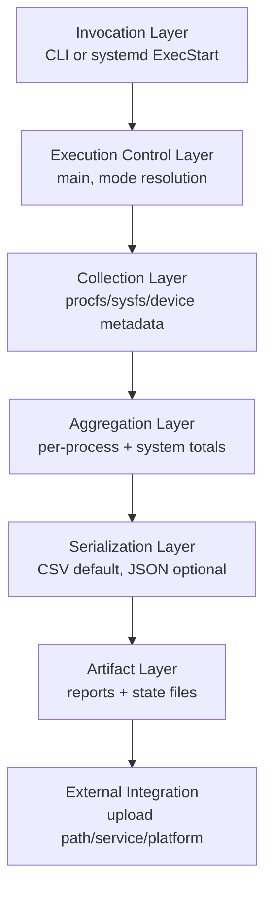
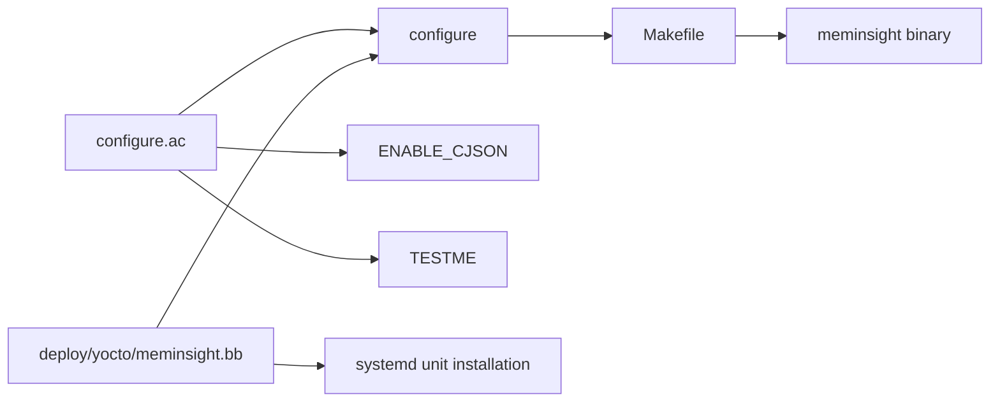
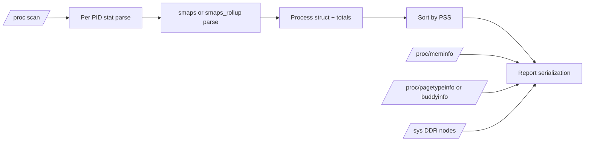
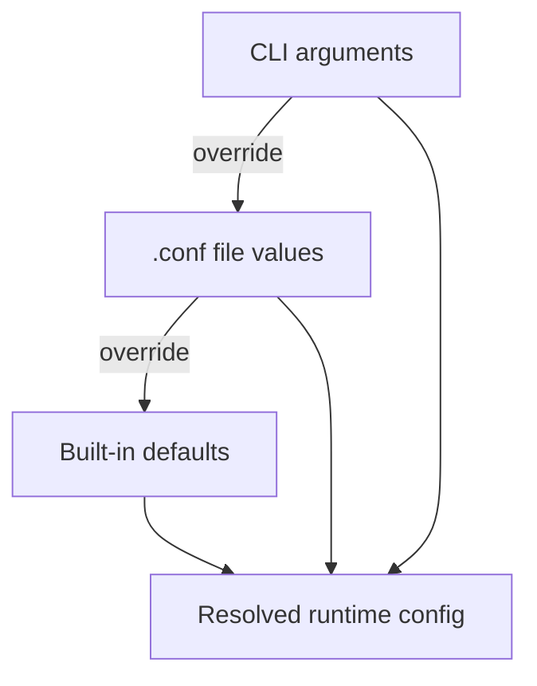
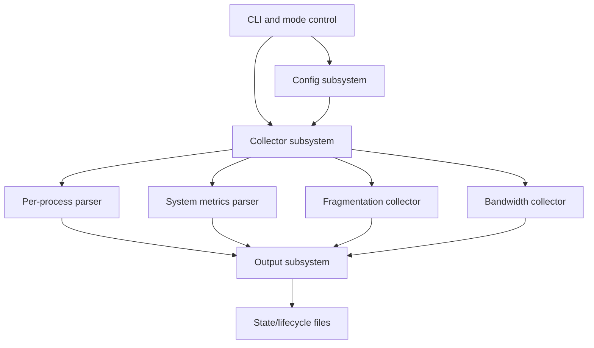
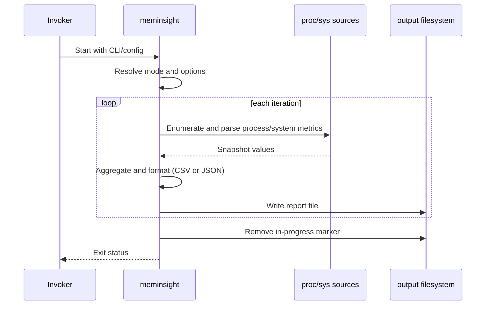

# MemInsight Baseline Architecture (OpenSpec Brownfield Onboarding)

## Document intent

This document provides a professional baseline architecture understanding for meminsight to support OpenSpec adoption in a brownfield embedded Linux/RDK context.

Scope basis:
- Repository: rdkcentral/meminsight
- Analysis context requested: current working repository snapshot
- Evidence source: repository files only (code, build files, service/deploy files, tests, and docs)

Operating rule:
- This is an analysis artifact, not a product-code change.
- Facts are code-truth from the repository snapshot.
- Inferences, assumptions, and unknowns are explicitly separated.

---

## 1) High-level system architecture

### Facts
- The build outputs a single primary executable, meminsight, from src/meminsight.c via autotools (configure.ac, Makefile.am).
- Runtime supports at least two operational modes:
  - System-wide scan mode (default path in main())
  - Config-driven whitelist mode using --config and handleConfigMode().
- The executable reads Linux runtime telemetry primarily from:
  - /proc (per-process stat/smaps/smaps_rollup, meminfo, uptime, fragmentation files)
  - /sys (DDR bandwidth files)
  - /etc/device.properties (device interface key lookup)
  - /version.txt (firmware image string)
- Output is file-based reports in CSV by default, with optional JSON when built with --enable-cjson and successfully loading libcjson at runtime.
- Deployment artifacts include:
  - systemd unit deploy/systemd/meminsight.service
  - Yocto recipe deploy/yocto/meminsight.bb
- The systemd service starts meminsight as root with --config /etc/meminsight.conf.

### Inferences
- MemInsight is designed to operate as both:
  - on-demand one-shot/finite capture utility
  - long-running periodic collector
- In platform deployment, it likely acts as a diagnostics telemetry producer feeding downstream upload/collection flows via marker/state files.
- The architecture is intentionally monolithic in code organization (single C translation unit), but functionally decomposed into collector and report subsystems.

### Assumptions
- The production deployment around meminsight includes external automation/services that consume generated report files and state markers.
- The component is intended for constrained devices where defensive parsing and fail-soft behavior is preferred over strict hard-fail collection.

### Unknowns / Manual validation required
- Exact RDK pipeline integration boundaries (which service or backend consumes outputs) are not fully specified in code.
- Actual production scheduling model (always-on service vs scheduled invocations vs mixed) requires deployment-level validation.
- Device fleet diversity assumptions (kernel version span, procfs variability) require runtime sampling on target devices.

### Layered view



---

## 2) Build and packaging architecture

### Facts
- configure.ac declares autotools project meminsight 1.0 with AC_PROG_CC and AC_PROG_CXX.
- Optional feature flags in configure.ac:
  - --enable-cjson: defines ENABLE_CJSON and validates libdl for runtime dlopen use.
  - --enable-test: defines TESTME.
- Makefile.am builds one program (bin_PROGRAMS = meminsight) from src/meminsight.c and installs src/meminsight.h as header.
- Yocto recipe deploy/yocto/meminsight.bb inherits autotools and systemd and wires PACKAGECONFIG[cjson] to --enable-cjson.
- systemd service file is installed by recipe do_install:append().

### Inferences
- JSON support is intentionally optional and deployment-flexible; binary can run without hard cJSON dependency by falling back to CSV.
- Build composition prioritizes simplicity and portability over modular library layering.

### Assumptions
- Cross-compilation/toolchain specifics are handled by external Yocto build environment, not in-repo custom logic.

### Unknowns / Manual validation required
- Supported compiler/version matrix and hardening flags are not explicitly codified in analyzed files.
- Packaging variants beyond Yocto snippet are not fully represented in this repository.

### Build pipeline view



---

## 3) Binary/executable and entry-point analysis

### Facts
- Primary executable entry point: main() in src/meminsight.c.
- Key initialization in main():
  - CLI parse and mode selection
  - optional JSON runtime loader invocation
  - smaps vs smaps_rollup strategy selection
  - optional fragmentation source selection
  - bandwidth source availability probing
- Two major capture flows:
  - collectSystemMemoryStats() for system-wide process enumeration
  - handleConfigMode() for whitelist/PID targeted capture
- Both flows write run metadata into configstore and create/remove in-progress marker.

### Inferences
- The CLI is the primary contract surface; config mode is a policy overlay for controlled process targeting.
- Error handling is mostly local and non-fatal for per-process failures, preserving run continuity.

### Assumptions
- Existing CLI/output behavior is depended on by external scripts and should be treated as stable contract.

### Unknowns / Manual validation required
- Consumer expectations around subtle CLI precedence edge cases should be validated with downstream users.

### Startup and mode-resolution flow

```mermaid
flowchart TD
  A[main(argc, argv)] --> B[Parse CLI flags]
  B --> C[Validate constraints\njson-pretty requires fmt json, upload interval requires upload enable]
  C --> D[Probe optional data sources\nbandwidth, fragmentation]
  D --> E[Choose smaps source\nsmaps_rollup if available unless forced]
  E --> F{Config mode?}
  F -->|yes| G[handleConfigMode]
  F -->|no| H[collectSystemMemoryStats]
  G --> I[Exit code]
  H --> I
```

---

## 4) Runtime data collection model

### Facts
- Per-process collection pipeline includes:
  - PID discovery from /proc directory entries
  - stat parsing from /proc/<pid>/stat
  - memory details from /proc/<pid>/smaps_rollup or /proc/<pid>/smaps
- System-level collection includes:
  - meminfo field extraction from /proc/meminfo
  - uptime from /proc/uptime
  - kernel version from uname()
  - optional fragmentation from /proc/pagetypeinfo preferred, fallback /proc/buddyinfo
  - optional DDR bandwidth from /sys nodes
- Aggregation behavior:
  - linked-list process records sorted by descending pssTotal
  - saturation guards to avoid unsigned overflow in totals
  - explicit synthetic totals row in CSV/JSON process outputs
- Sampling model:
  - iterative loop with sleep(interval)
  - long-run mode when no finite iteration plan is enforced
  - per-iteration timestamp and output file generation

### Inferences
- Data model is primarily snapshot-based, not delta-derived over history.
- Format-learning parsers for smaps/meminfo are optimized to reduce repeated scanning overhead across iterations.

### Assumptions
- Process churn is expected; parser and read failures are tolerated as partial data loss, not total run failure.

### Unknowns / Manual validation required
- Real-world overhead characteristics under high process counts or heavy map fragmentation are not benchmarked in-repo.
- Accuracy tradeoffs of learned-offset parsing across kernel/procfs drift require wider device validation.

### Collection pipeline



---

## 5) Configuration architecture

### Facts
- Configuration inputs:
  - CLI flags (main argument parsing)
  - config file in .conf format (parseConfig)
  - compile-time feature flags (ENABLE_CJSON, TESTME)
  - runtime source availability probes (/proc, /sys, library load)
- Explicit precedence implemented in code:
  - CLI values override config-file values for output/iterations/interval in config mode.
  - Config values override defaults when CLI does not provide overrides.
- Output format defaults to CSV; JSON requires both build-time support and runtime libcjson load success.
- If JSON runtime loading fails, code explicitly falls back to CSV.

### Inferences
- Configuration model is intentionally pragmatic and operationally safe for field deployments: permissive defaults and graceful fallbacks.

### Assumptions
- External orchestrators may rely on state/configstore outputs rather than parsing command-line arguments directly.

### Unknowns / Manual validation required
- Full precedence behavior for all combinations (especially long-run semantics with mixed CLI/config values) should be regression-tested as a matrix.
- Environment-variable based controls are not evident in current code path and may exist only externally.

### Configuration precedence view



---

## 6) Subsystem decomposition

### Facts
- CLI and mode control subsystem:
  - main(), printHelpAndUsage()
- Config parsing and whitelist subsystem:
  - parseConfig(), getPIDByProcessName(), handleConfigMode()
- Process collection subsystem:
  - fillProcessStatFields(), getProcessInfos* family
- System metrics subsystem:
  - saveMeminfo(), getSystemUptime(), getKernelVersion(), getFirmwareImageName(), getMacAddress()
- Fragmentation subsystem:
  - selectFragmentationSource(), writePagetypeInfoCSV(), writeBuddyinfoCSV(), JSON variants
- Bandwidth subsystem:
  - updateBandwidthAvailability(), collectBandwidthData()
- Output/report subsystem:
  - CSV writers and JSON object serialization path
- State and lifecycle subsystem:
  - ensure_output_dir(), clear_dir_contents(), writeConfigStore(), touchFile(), removeFileIfPresent()

### Inferences
- The codebase is single-file but behaviorally split into clear subsystems with stable functional boundaries suitable for OpenSpec capability ownership.

### Assumptions
- Further modularization may be possible later, but current capability docs can map reliably to function clusters.

### Unknowns / Manual validation required
- Coupling hotspots and refactor risk should be validated with profiling and mutation testing before deep structural changes.

### Subsystem interaction map



---

## 7) Runtime flow documentation

### Startup flow

#### Facts
- Program prints executed command context and resolves feature/runtime availability.
- smaps source chosen by explicit force flag or capability probe.

#### Inferences
- Startup seeks deterministic behavior per run by fixing source choices early.

#### Assumptions
- Stable source choice across iterations avoids schema drift inside one run.

#### Unknowns / Manual validation required
- Runtime source toggling on long runs (if kernel interfaces appear/disappear) is not dynamically reevaluated in current startup-first design.

### Single collection cycle

#### Facts
- Build timestamped report filename.
- Gather per-process memory and stats.
- Gather system sections (meminfo, optional fragmentation, optional bandwidth).
- Emit report and totals; write markers/state lifecycle.

#### Inferences
- A single cycle is intended to be self-contained report artifact generation.

#### Assumptions
- Report consumers treat each file as immutable snapshot.

#### Unknowns / Manual validation required
- Atomicity guarantees for partial writes under storage faults require field validation.

### Repeated sampling cycle

#### Facts
- Loop continues based on long_run or iteration bound; sleeps for interval.

#### Inferences
- This is a periodic polling model rather than event-driven collection.

#### Assumptions
- Sleep jitter and scheduler delay are acceptable for intended observability use.

#### Unknowns / Manual validation required
- Time-drift implications for long captures are not explicitly compensated.

### Runtime narrative diagram



---

## 8) Platform and external dependency analysis

### Facts
- Linux-specific dependency is strong:
  - procfs layout assumptions
  - sysfs DDR node assumptions
  - ioctl/uname/socket POSIX APIs
- Optional runtime shared library dependency for JSON through dlopen of libcjson.
- Systemd/Yocto artifacts indicate platform integration patterns.
- Service unit runs as root.

### Inferences
- Component is intentionally Linux/RDK-oriented and not portability-targeted for non-Linux OSes.
- Root execution likely chosen for broad /proc and system access consistency.

### Assumptions
- Device images include required pseudo-filesystem mounts and expected kernel interfaces.

### Unknowns / Manual validation required
- Minimal required privileges for all features (especially sysfs writes) should be validated; root may be conservative default.
- Non-RDK Linux portability constraints are only partially inferable from code.

### Dependency map

```mermaid
flowchart LR
  A[meminsight binary] --> B[/proc interfaces]
  A --> C[/sys interfaces]
  A --> D[POSIX libc/system calls]
  A --> E[libdl]
  E --> F[libcjson optional]
  A --> G[systemd integration]
  A --> H[Yocto packaging]
```

---

## 9) Operational and reliability analysis

### Facts
- Defensive behaviors present:
  - many file-open/read failures logged and tolerated per source/path
  - optional collectors degrade gracefully when unavailable
  - unsigned saturation helper to prevent overflow on totals
  - explicit CSV fallback when JSON runtime load fails
- Race-sensitive domain handling:
  - process discovery may encounter transient PID disappearance; code handles parse/open failures and continues.

### Inferences
- Reliability priority is capture continuity over strict completeness.
- Some partial-report scenarios are expected by design.

### Assumptions
- Operational consumers can tolerate missing rows/sections in degraded runs.

### Unknowns / Manual validation required
- No explicit watchdog/health telemetry in-repo for long-running degraded states.
- Behavior under extreme low-memory pressure and filesystem-full conditions should be validated on target devices.

### Initial risk register

| Area | Risk | Current posture | Validation needed |
|---|---|---|---|
| Procfs parsing drift | Field/order changes could degrade accuracy | Learned offsets plus fallback logic | Kernel-version matrix tests |
| PID churn | Missing process files during scan | Continue-on-error behavior | Stress test with churn generator |
| Storage faults | Partial/failed report writes | Error logging and return paths | Fault injection on output path |
| Optional JSON path | Runtime library mismatch | CSV fallback | Build/runtime matrix checks |
| Long-run overhead | CPU and IO accumulation | Lightweight C implementation | On-device profiling |

---

## 10) Testing and validation surface

### Facts
- Repository contains fixture-based test harness:
  - test/run_ut.sh
  - multiple fixture directories for positive and negative parsing cases
  - buddyinfo/pagetypeinfo variant fixtures
- TESTME compile-time mode and --test runtime path explicitly support deterministic parser checks.
- Build wrapper cov_build.sh supports --test and --enable-cjson permutations.

### Inferences
- Parser compatibility and regression resilience are a major test focus.

### Assumptions
- End-to-end platform integration tests are likely outside this repository (e.g., device/system testing pipelines).

### Unknowns / Manual validation required
- Explicit unit-level function isolation test framework is not evident; testing appears fixture/integration leaning.
- Service-level/systemd lifecycle tests are not clearly represented in current in-repo test assets.

### Recommended architecture confidence checklist

1. Build matrix:
   - default build
   - --enable-cjson
   - --enable-test
   - --enable-cjson --enable-test
2. Fixture suite run and expected pass/fail baselines.
3. Runtime smoke on target-like Linux:
   - system-wide finite run
   - config whitelist run
   - frag-enabled run
   - JSON run with and without libcjson availability
4. State file lifecycle checks:
   - configstore content correctness
   - in-progress marker creation/removal
5. Soak run for long-run mode overhead and stability.

---

## 11) OpenSpec readiness assessment

### Facts
- Capability catalog exists in openspec/specs with index and parity matrix (C01-C12).
- Existing specs already map major behavior domains and implementation anchors.
- OpenSpec usage guides exist in docs and top-level OpenSpec folder.

### Inferences
- Repository is materially ready for OpenSpec-driven change planning.
- The next maturity step is architecture-focused baseline artifacts and explicit unknown/risk tracking for future changes.

### Assumptions
- Team intends to use OpenSpec changes workflow for intentional behavior deltas before implementation.

### Unknowns / Manual validation required
- Governance enforcement model (manual vs automated checks in CI) for OpenSpec conformance is not fully defined in currently analyzed assets.

### Recommended OpenSpec hierarchy extension

- openspec/architecture/
  - 00-baseline-architecture.md (this document)
  - 01-subsystem-catalog.md
  - 02-runtime-flows.md
  - 03-dependency-and-risk-register.md
  - 04-open-questions-and-validation-plan.md

- openspec/specs/
  - Keep capability-level As-Is behavior (already present).

- openspec/changes/
  - Keep intentional deltas only.

### Candidate requirement domains for follow-up specs

1. Robust procfs drift tolerance criteria across kernel families.
2. Report schema compatibility invariants and migration policy.
3. Long-run reliability and resource overhead acceptance thresholds.
4. State/upload integration contract and failure semantics.
5. Privilege and security posture for service deployment.

### Candidate operational invariants

1. CSV output remains available as baseline even when optional features fail.
2. Collector should not crash on missing optional data sources.
3. Process-scan partial failures should not abort entire iteration unless fatal path reached.
4. State marker lifecycle should leave no stale in-progress marker on normal completion.

### Candidate acceptance-criteria themes

1. Compatibility: output schema and section structure preservation.
2. Resilience: graceful degradation on unavailable sources/libraries.
3. Determinism: fixture-driven parser behavior under TESTME.
4. Operability: predictable lifecycle files and service execution behavior.

---

## Appendix: evidence anchors used for this baseline

Primary files analyzed:
- src/meminsight.c
- src/meminsight.h
- configure.ac
- Makefile.am
- cov_build.sh
- test/run_ut.sh
- deploy/systemd/meminsight.service
- deploy/yocto/meminsight.bb
- README.md
- docs/OPENSPEC_USAGE_GUIDE.md
- docs/ROLE_BASED_WORKFLOW_GUIDE.md
- openspec/specs/*

Evidence confidence statement:
- This baseline is repository-truth grounded.
- Areas requiring runtime/system integration confirmation are explicitly listed as Unknowns.
